### User

| カラム名 | 型     | 主キー | Not Null | 備考                   |
| -------- | ------ | ------ | -------- | ---------------------- |
| id       | int    | ✅     | ✅       | ユーザーID（自動採番） |
| name     | string |        | ✅       | 表示名                 |
| ...      | ...    |        |          | メール、パスワード等   |

### ChatRoom

| カラム名  | 型       | 主キー | Not Null | 備考                             |
| --------- | -------- | ------ | -------- | -------------------------------- |
| id        | int      | ✅     | ✅       | チャットルームID（自動採番）     |
| name      | string   |        |          | グループ名（個人チャットはNULL） |
| isGroup   | boolean  |        | ✅       | グループかどうか                 |
| createdAt | datetime |        | ✅       | 作成日時                         |
| updatedAt | datetime |        | ✅       | 更新日時（自動更新）             |

### ChatRoomMember

| カラム名     | 型                 | 主キー | Not Null | 備考                                 |
| ------------ | ------------------ | ------ | -------- | ------------------------------------ |
| id           | int                | ✅     | ✅       | ID（自動採番）                       |
| chatRoomId   | int                |        | ✅       | FK → ChatRoom.id                     |
| userId       | int                |        | ✅       | FK → User.id                         |
| joinedAt     | datetime           |        | ✅       | 参加日時                             |
| ユニーク制約 | chatRoomId, userId |        | ✅       | 同一チャットルームに重複参加できない |

### Message

| カラム名   | 型       | 主キー | Not Null | 備考                             |
| ---------- | -------- | ------ | -------- | -------------------------------- |
| id         | int      | ✅     | ✅       | メッセージID                     |
| chatRoomId | int      |        | ✅       | FK → ChatRoom.id                 |
| userId     | int      |        | ✅       | FK → User.id                     |
| content    | string   |        | ✅       | メッセージ本文                   |
| createdAt  | datetime |        | ✅       | 作成日時                         |
| deletedAt  | datetime |        |          | ソフト削除用。NULLなら未削除状態 |

### MessageRead

| カラム名     | 型                | 主キー | Not Null | 備考                                   |
| ------------ | ----------------- | ------ | -------- | -------------------------------------- |
| id           | int               | ✅     | ✅       | ID（自動採番）                         |
| messageId    | int               |        | ✅       | FK → Message.id                        |
| userId       | int               |        | ✅       | FK → User.id                           |
| readAt       | datetime          |        | ✅       | 既読日時                               |
| ユニーク制約 | messageId, userId |        | ✅       | 同じメッセージに複数回既読は記録しない |

### MessageReaction

| カラム名     | 型                      | 主キー | Not Null | 備考                                 |
| ------------ | ----------------------- | ------ | -------- | ------------------------------------ |
| id           | int                     | ✅     | ✅       | ID（自動採番）                       |
| messageId    | int                     |        | ✅       | FK → Message.id                      |
| userId       | int                     |        | ✅       | FK → User.id                         |
| type         | string                  |        | ✅       | リアクションの種類（👍、❤️など）     |
| createdAt    | datetime                |        | ✅       | リアクション日時                     |
| ユニーク制約 | messageId, userId, type |        | ✅       | 同一ユーザーの同じリアクションを防止 |

### MessageMention

| カラム名        | 型  | 主キー | Not Null | 備考                                     |
| --------------- | --- | ------ | -------- | ---------------------------------------- |
| id              | int | ✅     | ✅       | ID（自動採番）                           |
| messageId       | int |        | ✅       | FK → Message.id                          |
| mentionedUserId | int |        | ✅       | FK → User.id（メンションされたユーザー） |

### ER図

```mermaid
erDiagram
    %% Users
    User ||--o{ ChatRoomMember : "userId → User.id"
    User ||--o{ Message : "userId → User.id"
    User ||--o{ MessageRead : "userId → User.id"
    User ||--o{ MessageReaction : "userId → User.id"
    User ||--o{ MessageMention : "mentionedUserId → User.id"

    %% ChatRooms
    ChatRoom ||--o{ ChatRoomMember : "chatRoomId → ChatRoom.id"
    ChatRoom ||--o{ Message : "chatRoomId → ChatRoom.id"

    %% Messages
    Message ||--o{ MessageRead : "messageId → Message.id"
    Message ||--o{ MessageReaction : "messageId → Message.id"
    Message ||--o{ MessageMention : "messageId → Message.id"

    %% Tables
    User {
        int id PK
        string name
    }

    ChatRoom {
        int id PK
        string name
        boolean isGroup
        datetime createdAt
        datetime updatedAt
    }

    ChatRoomMember {
        int id PK
        int chatRoomId FK
        int userId FK
        datetime joinedAt
    }

    Message {
        int id PK
        int chatRoomId FK
        int userId FK
        string content
        datetime createdAt
        datetime deletedAt
    }

    MessageRead {
        int id PK
        int messageId FK
        int userId FK
        datetime readAt
    }

    MessageReaction {
        int id PK
        int messageId FK
        int userId FK
        string type
        datetime createdAt
    }

    MessageMention {
        int id PK
        int messageId FK
        int mentionedUserId FK
    }
```

