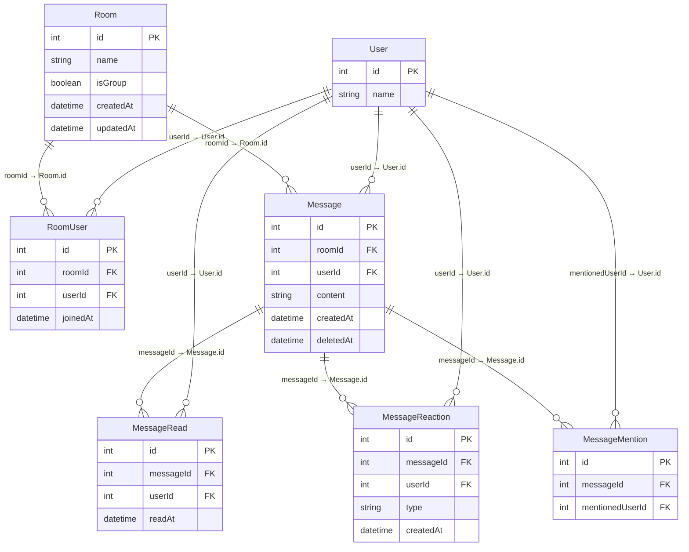

### User

| カラム名 | 型     | 主キー | Not Null | 備考                    |
| -------- | ------ | ------ | -------- | ----------------------- |
| id       | int    | ✅     | ✅       | ユーザー ID（自動採番） |
| name     | string |        | ✅       | 表示名                  |
| ...      | ...    |        |          | メール、パスワード等    |

### Room

| カラム名  | 型       | 主キー | Not Null | 備考                              |
| --------- | -------- | ------ | -------- | --------------------------------- |
| id        | int      | ✅     | ✅       | チャットルーム ID（自動採番）     |
| name      | string   |        |          | グループ名（個人チャットは NULL） |
| isGroup   | boolean  |        | ✅       | グループかどうか                  |
| createdAt | datetime |        | ✅       | 作成日時                          |
| updatedAt | datetime |        | ✅       | 更新日時（自動更新）              |

### RoomUser

| カラム名     | 型             | 主キー | Not Null | 備考                                 |
| ------------ | -------------- | ------ | -------- | ------------------------------------ |
| id           | int            | ✅     | ✅       | ID（自動採番）                       |
| roomId       | int            |        | ✅       | FK → Room.id                         |
| userId       | int            |        | ✅       | FK → User.id                         |
| joinedAt     | datetime       |        | ✅       | 参加日時                             |
| ユニーク制約 | roomId, userId |        | ✅       | 同一チャットルームに重複参加できない |

### Message

| カラム名  | 型       | 主キー | Not Null | 備考                              |
| --------- | -------- | ------ | -------- | --------------------------------- |
| id        | int      | ✅     | ✅       | メッセージ ID                     |
| roomId    | int      |        | ✅       | FK → Room.id                      |
| userId    | int      |        | ✅       | FK → User.id                      |
| content   | string   |        | ✅       | メッセージ本文                    |
| createdAt | datetime |        | ✅       | 作成日時                          |
| deletedAt | datetime |        |          | ソフト削除用。NULL なら未削除状態 |

### MessageRead

| カラム名     | 型                | 主キー | Not Null | 備考                                   |
| ------------ | ----------------- | ------ | -------- | -------------------------------------- |
| id           | int               | ✅     | ✅       | ID（自動採番）                         |
| messageId    | int               |        | ✅       | FK → Message.id                        |
| userId       | int               |        | ✅       | FK → User.id                           |
| readAt       | datetime          |        | ✅       | 既読日時                               |
| ユニーク制約 | messageId, userId |        | ✅       | 同じメッセージに複数回既読は記録しない |

### MessageReaction

| カラム名     | 型                      | 主キー | Not Null | 備考                                 |
| ------------ | ----------------------- | ------ | -------- | ------------------------------------ |
| id           | int                     | ✅     | ✅       | ID（自動採番）                       |
| messageId    | int                     |        | ✅       | FK → Message.id                      |
| userId       | int                     |        | ✅       | FK → User.id                         |
| type         | string                  |        | ✅       | リアクションの種類（👍、❤️ など）    |
| createdAt    | datetime                |        | ✅       | リアクション日時                     |
| ユニーク制約 | messageId, userId, type |        | ✅       | 同一ユーザーの同じリアクションを防止 |

### MessageMention

| カラム名        | 型  | 主キー | Not Null | 備考                                     |
| --------------- | --- | ------ | -------- | ---------------------------------------- |
| id              | int | ✅     | ✅       | ID（自動採番）                           |
| messageId       | int |        | ✅       | FK → Message.id                          |
| mentionedUserId | int |        | ✅       | FK → User.id（メンションされたユーザー） |

### ER 図

