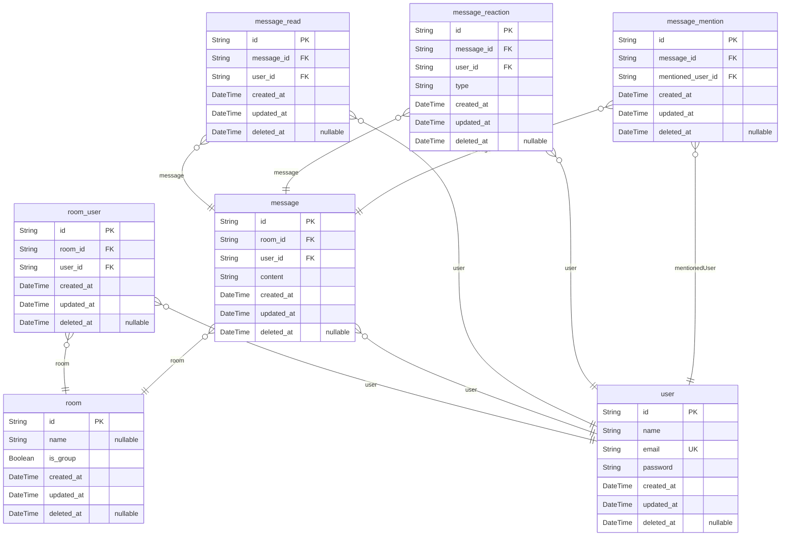

# データベースER図

> Generated by [`prisma-markdown`](https://github.com/samchon/prisma-markdown)

- [default](#default)

## default

### `user`

ユーザ

Properties as follows:

- `id`:
- `name`:
- `email`:
- `password`:
- `created_at`:
- `updated_at`:
- `deleted_at`:

### `room`

チャットルーム

Properties as follows:

- `id`:
- `name`:
- `is_group`:
- `created_at`:
- `updated_at`:
- `deleted_at`:

### `room_user`

チャットルーム参加者

Properties as follows:

- `id`:
- `room_id`:
- `user_id`:
- `created_at`:
- `updated_at`:
- `deleted_at`:

### `message`

メッセージ

Properties as follows:

- `id`:
- `room_id`:
- `user_id`:
- `content`:
- `created_at`:
- `updated_at`:
- `deleted_at`:

### `message_read`

既読管理

Properties as follows:

- `id`:
- `message_id`:
- `user_id`:
- `created_at`:
- `updated_at`:
- `deleted_at`:

### `message_reaction`

リアクション

Properties as follows:

- `id`:
- `message_id`:
- `user_id`:
- `type`:
- `created_at`:
- `updated_at`:
- `deleted_at`:

### `message_mention`

メンション

Properties as follows:

- `id`:
- `message_id`:
- `mentioned_user_id`:
- `created_at`:
- `updated_at`:
- `deleted_at`:
